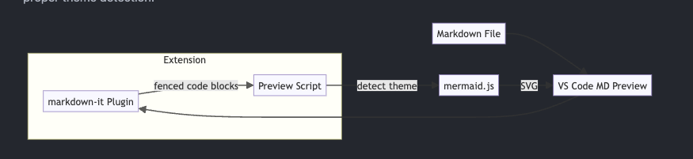
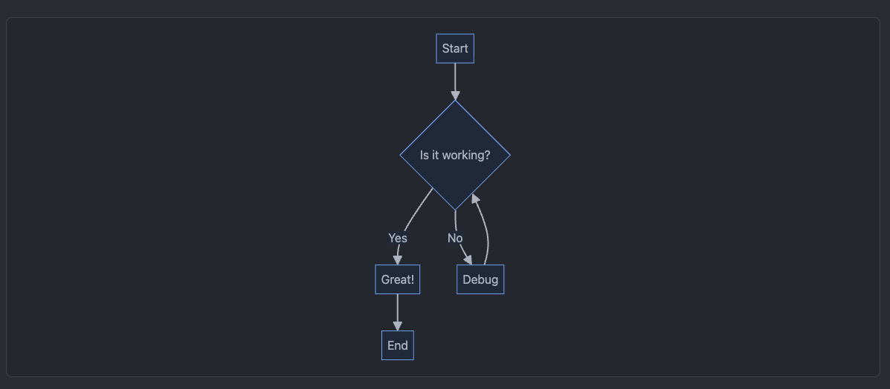
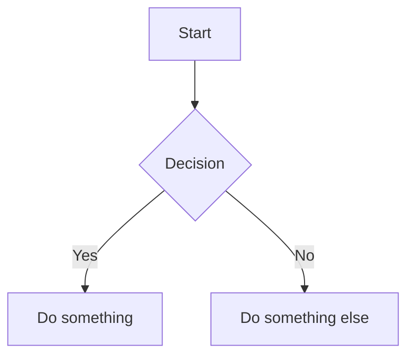

# Mermaid Ink

A VS Code / Cursor extension that renders Mermaid diagrams in markdown preview with proper dark/light theme support.

**No more black text on dark backgrounds.**

## Before & After

| Default (Cursor) | With Mermaid Ink |
|------------------|------------------|
|  |  |

## Features

- Renders Mermaid diagrams directly in markdown preview
- Auto-detects your editor theme (dark/light/high-contrast)
- Re-renders when you switch themes
- Supports all Mermaid diagram types: flowcharts, sequence diagrams, class diagrams, state diagrams, ER diagrams, pie charts, and more

## Installation

> **A note on VS Code Marketplace**
> There's a version on VS Code Marketplace, but it won't get updates. Why? Because Microsoft wants me to create an Azure DevOps account just to publish a f***ing extension. No. I'm not signing up for your bloated enterprise CI/CD platform to share a 50-line markdown plugin. Open VSX exists, it works, and it doesn't require mass surveillance cosplaying as a developer experience. Get the latest from Open VSX or GitHub Releases.

### From Open VSX (recommended)

Search for "Mermaid Ink" in the Extensions sidebar.

### From GitHub Releases

1. Download the latest `.vsix` from [Releases](https://github.com/timmilesdw/mermaid-ink/releases)
2. In VS Code/Cursor: `Cmd+Shift+P` → "Extensions: Install from VSIX..."

### From Source

```bash
git clone https://github.com/timmilesdw/mermaid-ink.git
cd mermaid-ink
npm install
npm run build
```

Then press `F5` in VS Code/Cursor to launch with the extension loaded.

## Usage

Just write mermaid code blocks in your markdown:

````markdown

````

Open markdown preview (`Cmd+Shift+V` / `Ctrl+Shift+V`) and the diagram renders with colors matching your theme.

## Supported Diagrams

- Flowcharts
- Sequence diagrams
- Class diagrams
- State diagrams
- Entity Relationship diagrams
- Pie charts
- Gantt charts
- Git graphs
- And more...

## Development

```bash
npm install
npm run watch   # Rebuild on changes
```

Press `F5` to launch Extension Development Host.

## License

MIT
