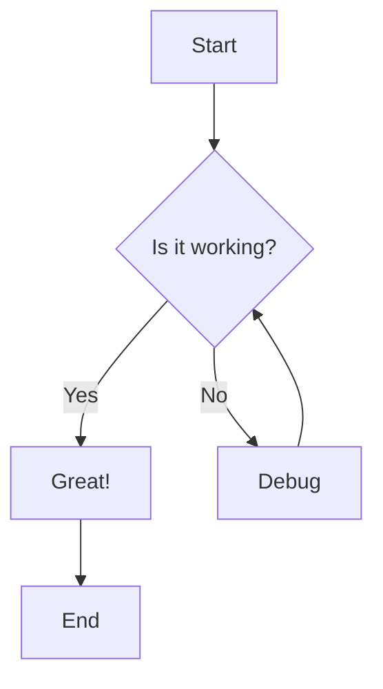
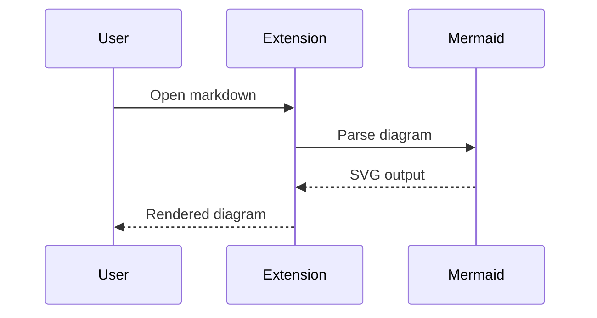
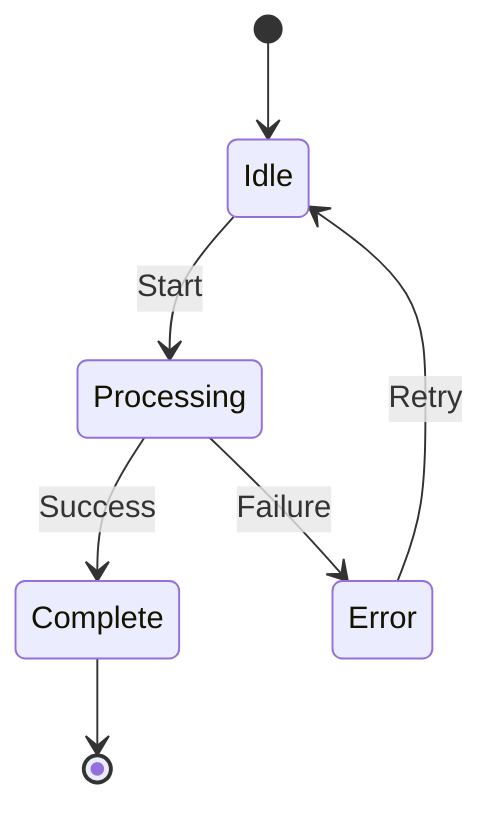
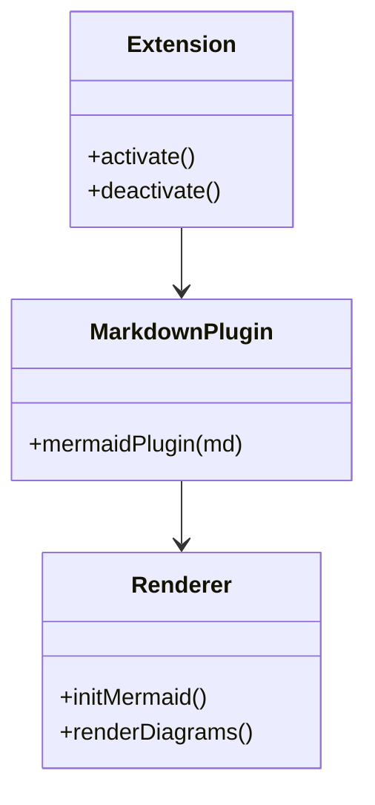
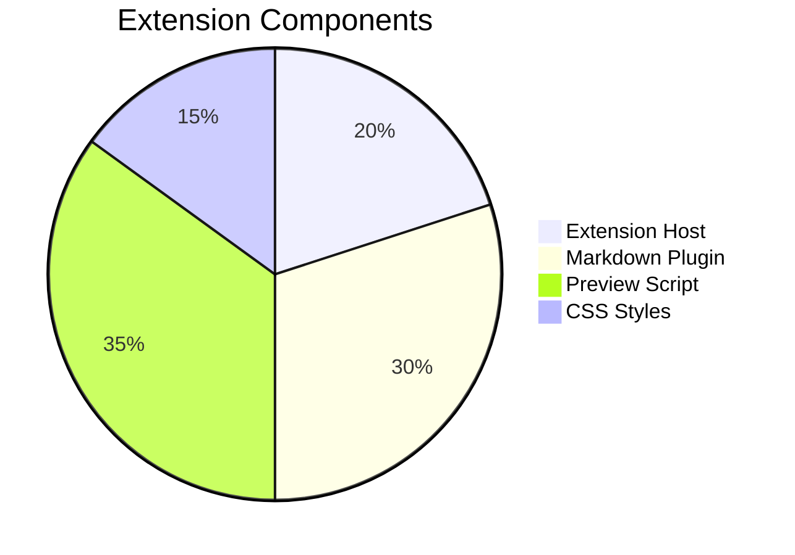

# Mermaid Viewer Test

Test your extension with these diagrams.

## Flowchart

```mermaid
flowchart TD
    A[Start] --> B{Is it working?}
    B -->|Yes| C[Great!]
    B -->|No| D[Debug]
    D --> B
    C --> E[End]
```

## Sequence Diagram

```mermaid
sequenceDiagram
    participant User
    participant Extension
    participant Mermaid

    User->>Extension: Open markdown
    Extension->>Mermaid: Parse diagram
    Mermaid-->>Extension: SVG output
    Extension-->>User: Rendered diagram
```

## State Diagram

```mermaid
stateDiagram-v2
    [*] --> Idle
    Idle --> Processing: Start
    Processing --> Complete: Success
    Processing --> Error: Failure
    Error --> Idle: Retry
    Complete --> [*]
```

## Class Diagram

```mermaid
classDiagram
    class Extension {
        +activate()
        +deactivate()
    }
    class MarkdownPlugin {
        +mermaidPlugin(md)
    }
    class Renderer {
        +initMermaid()
        +renderDiagrams()
    }
    Extension --> MarkdownPlugin
    MarkdownPlugin --> Renderer
```

## Pie Chart

```mermaid
pie title Extension Components
    "Extension Host" : 20
    "Markdown Plugin" : 30
    "Preview Script" : 35
    "CSS Styles" : 15
```
